

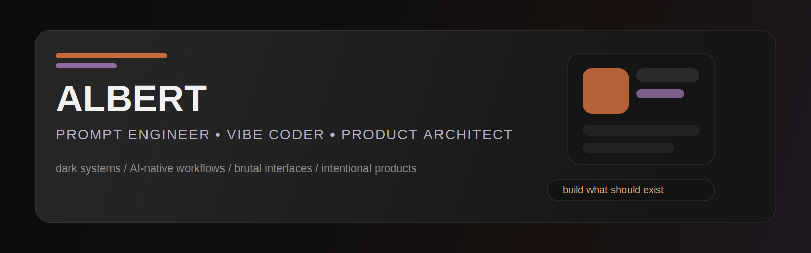

 

# KAMELOT
### Prompt Engineer  Vibe Coder  Product Architect

`building systems, interfaces and AI-native products`

 

[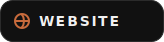](http://www.kamelot.site/)
[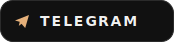](https://t.me/DOWHATUWILT)
[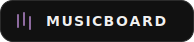](https://musicboard.app/kamelot.exe)
[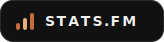](https://stats.fm/kamelot.exe)
[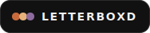](https://letterboxd.com/albert91/)
[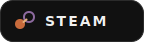](https://steamcommunity.com/profiles/76561199803319225/)

---

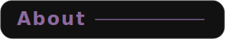

I build digital products with a strong focus on:

- prompt engineering
- vibe coding
- product systems
- interface design
- AI-assisted workflows
- full-stack web architecture

I like software that feels **sharp, cinematic and intentional**.

---

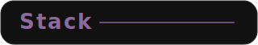

---

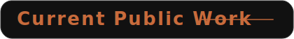

### Prism Calendar
Open-source calendar / productivity system focused on clarity, flow and modern desktop UX.

---

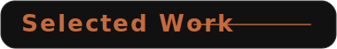

Not everything I build is public.

Some projects stay private, internal or experimental  
focused on systems design, commerce infrastructure, language tech and AI-native workflows.

---

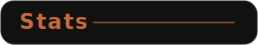

---

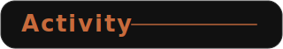

---

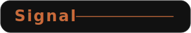

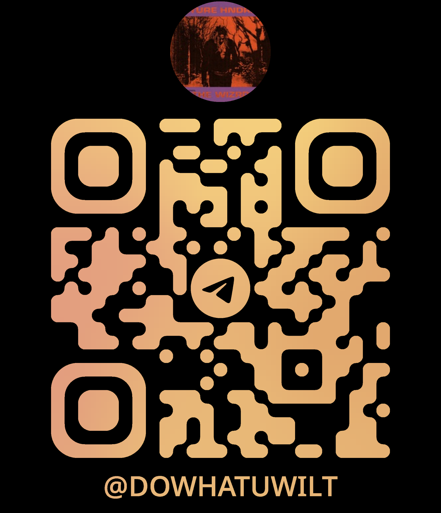

  

**Website:** [kamelot.site](http://www.kamelot.site/)

---

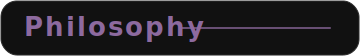

> Build what should exist.

  

